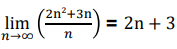

# cp1_Algorithm Analysis (Big-Oh notation)

---
- 알고리즘의 이론적 분석 vs 실험적 분석
- Big-Oh notation
- Comparison of Algorithms 
- Algorithm analysis using Big-Oh notation
---

### 매개변수(Parameter) : 문제에서 언급된 할당되지 않은 변수
### 실체(Instance : 매개변수에 실제로 할당된 값

##  알고리즘의 이론적 분석 vs 실험적 분석

알고리즘의 성능을 분석하는 방법은 2가지임.  

1. 실험적 분석 : 알고리즘을 소스코드로 구현 -> 실제 동작하여 시간측정  

실험적 분석방법은 실제 구현하기까지 오랜 시간이 걸리는 단점이 있음. 그리고 외부요인(컴퓨터의 성능 등)으로 인해 정확한 비교가 힘듦.  

2. 이론적 분석
알고리즘 수행시간(즉, 성능)을 실제 구현이 아닌 high level에서 이론적으로 기술하는 방법임.

보통 입력사이즈 N으로 관한 함수로 표현되며, 하드웨어나 소프트웨어와 무관하게 성능을 표시할 수 있음.  

이론적 분석을 통해 구한 알고리즘 수행시간 = 시간복잡도 (time complextiy)

### 기본연산 - 상수시간
숫자를 변수에 대입  
호출 및 반환  
사칙연산  
get,set연산  
등   

이런 단일 연산들은 입력크기와 무관하기 때문에, 상수시간이 소모된다고 함.   

* 선언은 단일연산에 속하지 않음  

## Big-Oh notation

### 점근적 분석(asymptotic analysis) : 입력의 크기가 충분히 큰 경우에 대한 분석.

lim(2n^2 +3n / 𝑛 )  = 2n +  3
𝑛→∞

### Big-Oh notation (Big-Oh 표기법) : 점근적 상한을 표시, 최악의 성능(시간)을 표기함.

### Big-Oh 표기법) 의 수학적 정의

f(n) 와 g(n) 를 자연수에서 실수로의 함수일때, 
이 때 만약 모든 n > n0 에 대하여  

**f(n) ≤ c•g(n)**

를 만족하는 어떤 실수 constant c>0 와 자연수 n0 > 0 이 존재하면 f(n) = O(g(n)) (f(n) is big-oh of (order) g(n)) 이라고 한다.  

###  Big-Oh 규칙

1. 함수의 각 term의 계수는 생략 가능 (ex : 13n2 = O(n2) )  
2. a > b 인 경우 na 와 nb term 이 같이 있으면 na term 만 남길 수 있음  
(이 경우 na dominates nb 라 함) ex: f(n) = n4 + n3 = O(n4)  
3. 어떠한 지수함수 (exponential) term도 polynomial term (다항식) 을 dominate 함  
(ex : 1.00001n dominates n100000000)  
4. 어떠한 polynomial term 도 logarithm (로그 함수) term 을 dominate 함.  
(ex : n dominates (log n)100000000)  

##  Comparison of Algorithms 

Ex) f1(n) = 2n+20 -> O(n) vs f2(n) = n^2 -> O(n62 )  
- f1 = O(f2) 이지만 f2 ≠ O(f1) 임
- 실제로 n이 6 이상인 경우 f1 은 언제나 f2 보다 값이 작음. 
- 따라서 n이 매우 작은 특수한 경우에는 f2 시간이 걸리는 알고리즘이 f1 시간이 걸
리는 알고리즘보다 더 우수하지만, 일반적으로는 후자가 전자보다 이론적으로 더
우수한 알고리즘

### More notations : Notation Ω (Omega), Notation Θ (Theta)

 
## Algorithm analysis using Big-Oh notation

1) 변수의 대입 횟수
2) 반복문 (for, while…) 에서의 반복 횟수
3) 함수의 호출 및 리턴 수

등이 입력 크기에 비례하여 어느 정도로 커지는지 파악하는 것이 중요함 
